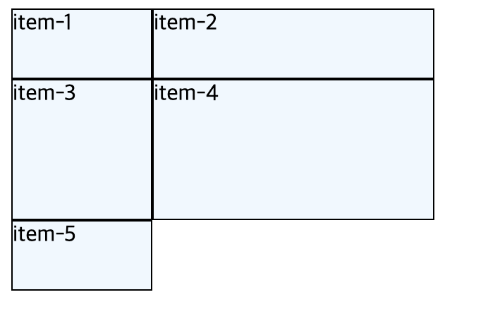
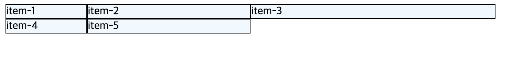
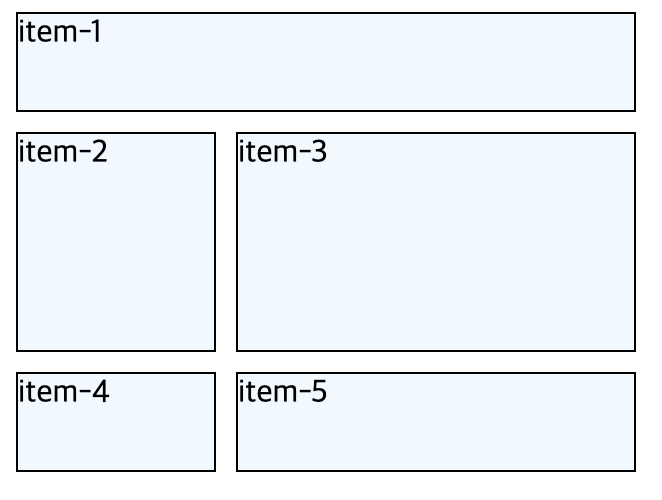

# Grid layout

## **1. Life before grid**

grid layout을 배우기 전 float layout과 flex layout을 배웠다. flex layout은 요소들을 좌우, 상하, 중앙 등으로 배치하기에 용이하지만, 웹페이지 레이아웃을 그리드 형태로 구현함에 있어 불편함이 존재했다. 그래서 등장한 것이 grid layout이다.

## **2. Basic concept of CSS grids**

flexbox가 1차원 시스템이라면, grid는 2차원 시스템이다.


## **3. Manual**

먼저, flexbox와 마찬가지로 container가 필요하다. grid container 안에 여러 개의 grid items가 들어가게 된다.

grid container에 `display: grid;`를 추가해준다.

<br/>

### 3.1. grid-template-columns | rows

#### 3.1.1. px로 표현하기

```css
.grid-container {
  display: grid;
  grid-template-columns: 100px 200px;
  grid-template-rows: 50px 100px 50px;
}
```



<br/>

#### 3.1.2. fraction으로 표현하기

```css
.grid-container {
  display: grid;
  grid-template-columns: 1fr 2fr 3fr;
}
```


flex-grow와 같은 기능을 한다.

<br/>

#### 3.1.3. repeat 사용하기

`grid-template-columns: 100px 100px 100px;` 대신,  
`grid-template-columns: repeat(3, 100px);` 으로 쓴다.

#### 3.1.4. grid-auto-rows

row의 개수가 몇개인지 정확하게 모를 때, 모든 아이템의 height에 디폴트값을 주고 싶을 때 유용하다.
`grid-auto-rows: 100px;`  
여기에 `grid-template-rows: 150px`을 추가하면, 첫번째 row의 높이가 150px이 되고, 나머지는 100px을 유지한다.

#### 3.1.5. minmax

`grid-auto-rows: minmax(100px, auto);`  
=> 높이는 최소 100px을 가지고, content가 overflow하게 되면, 그 크기만큼 높이값을 가져라.

#### 3.1.6. gap

`grid-column-gap: 10px`  
`grid-row-gap: 10px`  
=> `grid-gap: 10px`

<br/>

### 3.2. grid-template-areas

item에 `grid-area`로 설정한 이름을 지정해줘야함.

```css
.grid-container {
  display: grid;
  grid-template-columns: 100px 200px;
  grid-auto-rows: minmax(50px, auto);
  grid-gap: 10px;
  grid-template-areas:
    "header header"
    "sidebar content"
    "sidebar content";
}
.item-1 {
  grid-area: header;
}
.item-2 {
  grid-area: sidebar;
}
.item-3 {
  grid-area: content;
}
```



하지만 이 방법보단, grid-column-start를 자주 사용한다.

- c.f ) grid가 적용되지 않을 때 확인해야 할 규칙
  1. grid 내부에 grid-area의 영역이 전부 이어져 있는가? (ex: header 영역이 둘로 쪼개져 있고 그러면 안됨.)
  2. grid 내부에 grid-area의 영역이 continuous한가? (ex: header 영역이 ㄴ자 ㄱ자 등이어도 안됨.)
  3. grid-item에서 설정한 grid-area의 이름과 container에서 설정한 이름이 동일한가?

<br/>

### 3.3. rows and columns

```css
grid-column-start: 1;
grid-column-end: 5;
```

=> `grid-column: 1 / 5;`

`grid-column: 1 / -1;` => 처음부터 끝까지  
`grid-column: span 4;` => 4칸 차지해라  
`grid-column: (start) / span (# of cell);`

<br/>

### 3.4. line naming

[go to Mozilla](https://developer.mozilla.org/en-US/docs/Web/CSS/CSS_Grid_Layout/Layout_using_Named_Grid_Lines)

### 3.5. grid-template

### 3.6. place items

### 3.7. place content
