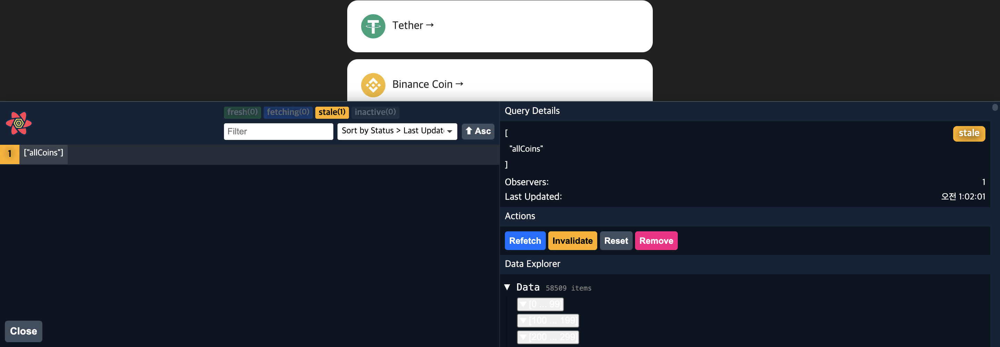

# **0. Installation**

```
npm i react-query
npm i @tanstack/react-query  // for typescript
```

<br />

# **1. Life before React-Query**

우리는 API를 불러올 때, 다음과 같은 복잡한 과정을 거쳤다.

- useEffect로 API를 한번만 불러온다.
- 데이터가 준비되면 이 데이터를 state에 집어넣는다.
- API를 불러왔으면, loading을 false로 바꿔준다.

```typescript
const [coins, setCoins] = useState<coinInterface[]>([]);
const [loading, setLoading] = useState(true);
useEffect(() => {
  (async () => {
    const response = await fetch("https://api.coinpaprika.com/v1/coins");
    const json = await response.json();
    setCoins(json.slice(0, 100));
    setLoading(false);
  })();
}, []);

//...
```

react-query는 우리 스스로 실행하고 있었던 이 로직들을 축약해준다.

<br />

# **2. React Query**

- [참고링크](https://tanstack.com/query/v3/docs/react/quick-start)

```javascript
// index.tsx
import { QueryClient, QueryClientProvider } from "react-query";

// Create a client
const queryClient = new QueryClient();

const root = ReactDOM.createRoot(
  document.getElementById("root") as HTMLElement
);

root.render(
  <React.StrictMode>
    // Provide the client to your App
    <QueryClientProvider client={queryClient}>
      <App />
    </QueryClientProvider>
  </React.StrictMode>
);
```

# **3. API 불러오기**

## 3.1. fetcher 함수 만들기

API 관련된 것들은 components와 멀리 떨어져 있도록 하는 것이 좋다. 그래서 api.ts를 새로 만들어 따로 저장한다.

```typescript
// export async function fetchCoins() {
//   const response = await fetch("https://api.coinpaprika.com/v1/coins");
//   const json = await response.json();
//   return json;
// }

export function fetchCoins() {
  return fetch("https://api.coinpaprika.com/v1/coins").then((res) =>
    res.json()
  );
}
```

URL를 부르고, URL로부터 json을 return한다.

## 3.2. useQuery

```typescript
import { useQuery } from "react-query";
function Coins() {
  const { isLoading, data } = useQuery<ICoin[]>(["allCoins"], fetchCoins);
}
```

useQuery는 두가지 argument를 필요로 한다.

- ["allcoins"] : query의 고유식별자
- fetchCoins : fetcher 함수

useQuery는 `isLoading`이라고 불리는 boolean 값을 return한다.

- `const [loading, setLoading] = useState(true);` 대체
- useQuery가 fetcher함수를 부르고, fetcher함수가 loading중이면 true, 다 불러왔으면 `data`에 저장한다.

## 3.3. isLoading, data 이름 바꾸는 방법

```typescript
const { isLoading: coinLoading, data: coinData } = useQuery<ICoin[]>(
  ["allCoins"],
  fetchCoins
);
```

## 3.4. fetcher함수에 argument가 있을 경우

anonymous function을 만들어 return해준다.

```typescript
const { isLoading: coinLoading, data: coinData } = useQuery<ICoin[]>(
  ["allCoins"],
  () => fetchCoins(coinId)
);
```

## 3.5. API 2개일 때

array를 만들어서 key값을 고유하게 만들어준다.

```typescript
const { isLoading: infoLoading, data: infoData } = useQuery<IInfoData>(
  ["info", coinId], //
  () => fetchCoinInfo(coinId!)
);
const { isLoading: tickersLoading, data: tickersData } = useQuery<IPriceData>(
  ["tickers", coinId], //
  () => fetchCoinTickers(coinId!)
);
```

<br />

# **4. react query의 장점**

예전에는 home 화면에서 코인 하나를 클릭하면 코인에 대한 정보가 보이고 다시 돌아오면 다시 로딩했다. 하지만, react-query를 사용하면 다시 로딩하지 않는다! 왜냐하면 react query가 데이터를 파괴하지 않고 데이터를 캐시에 저장해두기 때문이다.

## 4.1. Devtools

Devtools는 캐시에 있는 query를 볼 수 있다. 캐시에 있는게 무엇인지 그리고 우리가 무엇을 query했는지 안했는지를 시각화할 수 있는 가장 쉬운 방법이다.

```typescript
import { ReactQueryDevtools } from "react-query/devtools";
function App() {
  return (
    <>
      <GlobalStyle />
      <Router />
      <ReactQueryDevtools initialIsOpen={true} /> //
    </>
  );
}
```


<br />

## 4.2. Recap

- fetcher 함수를 만들수 있게 해준다.
- 아주 강력한 Caching mechanism을 가지고 있다.
- ReactQueryDevtools를 가지고 있다.
