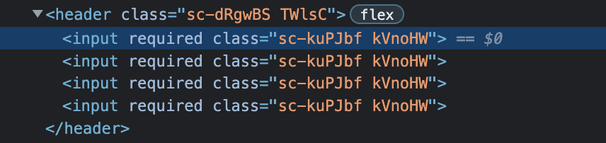

# Styled Components

## **1. Installation**

- `npm i styled-components@latest`
- 자동완성 extension: vscode-styled-components
- [styled-components.com](https://styled-components.com/)

## **2. How to use**

```javascript
import styled from "styled-components";

const Father = styled.div`
  display: flex;
`;
const BoxOne = styled.div`
  background-color: red;
  width: 100px;
  height: 100px;
`;
const BoxTwo = styled.div`
  background-color: blue;
  width: 100px;
  height: 100px;
`;
const Text = styled.span`
  color: white;
`;

function App() {
  return (
    <Father>
      <BoxOne>
        <Text>Hello</Text>
      </BoxOne>
      <BoxTwo></BoxTwo>
    </Father>
  );
}

export default App;
```

<br />

---

## **2. How to use**

- 알아서 className을 만든다.

### 2.1. props

### 2.2. Extend

```javascript
const Button = styled.button`
  color: #bf4f74;
  font-size: 1em;
  margin: 1em;
  padding: 0.25em 1em;
  border: 2px solid #bf4f74;
  border-radius: 3px;
`;

const TomatoButton = styled(Button)`
  color: tomato;
  border-color: tomato;
`;

render(
  <div>
    <Button>Normal Button</Button>
    <TomatoButton>Tomato Button</TomatoButton>
  </div>
);
```

- `<button>` 말고 `<a>`를 사용하고 싶다면? as를 이용해서 다른 element로 교체

```javascript
render(
  <div>
    <Button>Normal Button</Button>
    <Button as="a" href="/">Link</TomatoButton>
  </div>
);
```

- 모든 `<Input>`에 `required` attribute를 달고 싶다면?

```javascript
const Input = styled.input.attrs({ required: true })`
  background-color: antiquewhite;
`;
render(
  <Father as="header">
    <Input />
    <Input />
    <Input />
    <Input />
  </Father>
);
```


