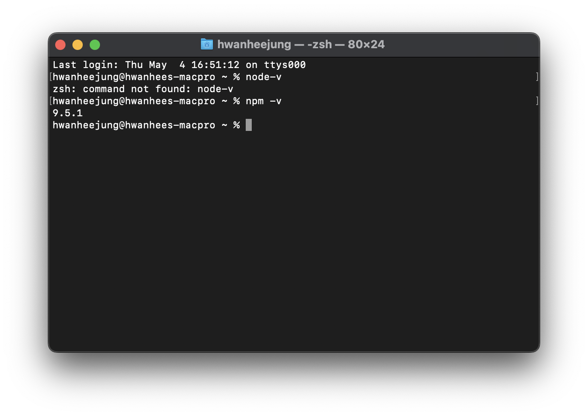
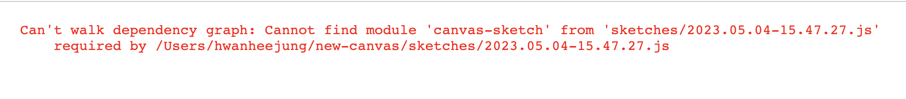
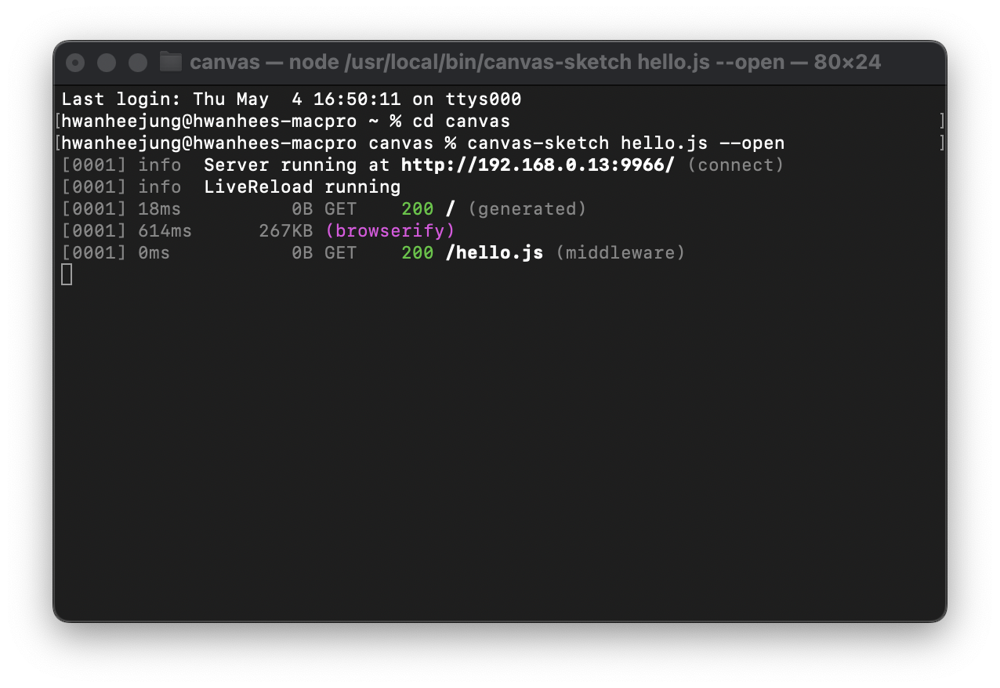
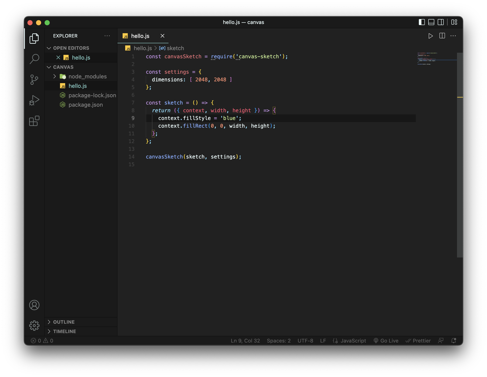
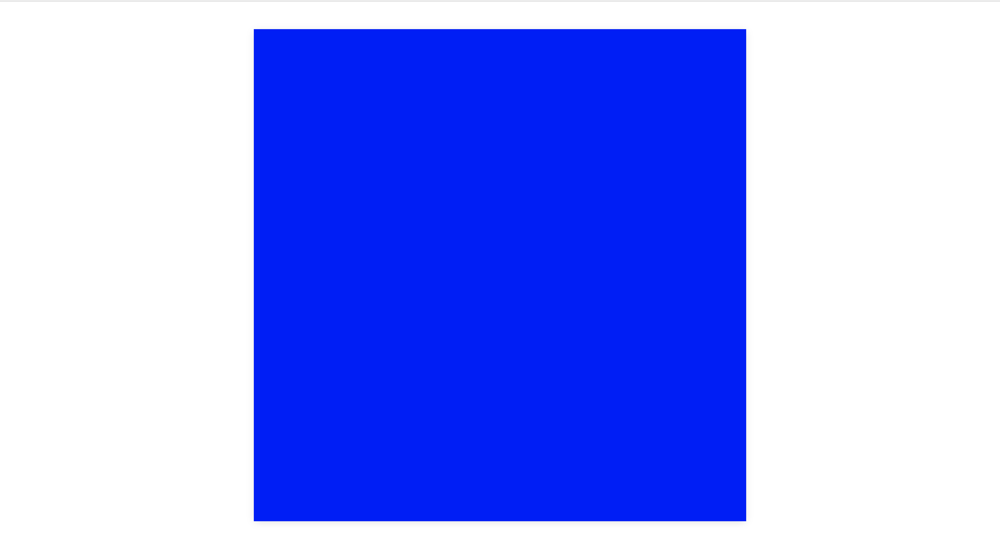

# Creative Coding 시작하기!

## 0. Create Coding?

유튭에서 creative coding이란걸 발견하고 재밌을 것 같아 마구마구 구글링을 하기 시작했다. css을 사용하지 않고 오직 javascript 코딩만으로 그림을 그리는, 흥미로운 세계였다.

- [Interactive Developer](https://youtu.be/lu9n9-oJ-mA)

<br/>

---

## 1. canvas-sketch : the offline-setup

### 1.1. what you need

- text editor (VSC, Vim, Sublime Text, ...)
- browser (Chrome, Brave, Firefox, ...)
- terminal (terminal app on MacOS, Cmder, ...)
- node.js

node.js까지 설치가 완료되었으면, terminal에 잘 설치되었는지 확인한다. node.js를 설치하면, npm은 자동으로 설치된다.

<br/>

### 1.2. canvas-sketch

이제 `canvas-sketch`라는 모듈을 설치해야 한다.

> `sudo npm install canvas-sketch-cli -g`

[installation](https://github.com/mattdesl/canvas-sketch/blob/master/docs/installation.md)
이 링크대로 진행했는데, 갑자기 오류가 떴다..도대체 왜..?


ㅂㄷㅂㄷ

구글링으로 찾은 해결방법!! >> [cannot find module](https://github.com/mattdesl/canvas-sketch/issues/67)

> terminal에 `sudo npm install canvas-sketch` 입력하기



> ```
> cd canvas
> canvas-sketch hello.js --new --open
> ```

=> canvas 폴더 안에, canvas-sketch와 hello.js를 만들고, 열어라  
=> 그냥 열 때에는 --new 생략

<br/>

### 1.3. Check

확인하기 위해 배경색을 blue로 바꾼다.




완료!!

### 1.4. Export into png

browser에서 `Ctrl + s` or `Cmd + s`

> $ canvas-sketch hello.js --output=output

=> output 폴더에 png파일이 저장된 것을 확인할 수 있다.

<br/>

## 2. Terminal 사용법

- $ mkdir = make dir
- $ cd = change dir
- $ npm list -g = 설치된 npm 리스트 확인
