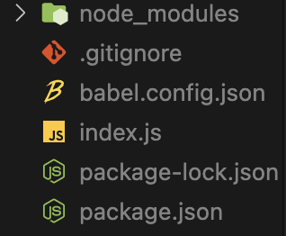

# The Tower of Babel

babel은 nodeJS가 이해하지 못하는 최신 자바스크립트를 컴파일해줌.

- nodeJS가 이해하는 자바스크립트만 쓰거나,
- [babel](https://babeljs.io/)을 쓰자

<br/>

---

## **1. NodeJS에서 사용 가능한 babel 설치**

### 1.1. installation

```
npm install --save-dev @babel/core
```

package.json을 확인하면, 다음과 같은 코드가 추가되었다.

```json
"devDependencies": {
    "@babel/core": "^7.21.8"
  }
```

### 1.2. create `babel.config.json` configuration file

```
 $ touch babel.config.json
```

그냥 파일 추가한것  


`babel.config.json`에

```json
{
  "presets": ["@babel/preset-env"]
}
```

추가하고, 하나 더 다운

```
npm install @babel/preset-env --save-dev
```

그러면, package.json이 업데이트된다.

```json
"devDependencies": {
    "@babel/core": "^7.21.8",
    "@babel/preset-env": "^7.21.5"
  }
```

## <br/>

---

## **2. 설명**

### 2.1. devDependencies

package.json 안에 dependencies가 아니라 devDependencies에 저장되었다. 뭐가 다를까?

- 개발자에게 필요한 dependencies
- 나는 최신 문법을 쓰고 싶은데 그러려면 babel이 필요해!
- 어차피 모든것은 node_modules에 저장되기 때문에 어디에 쓰든 상관없긴 함; 우리가 보기에 편하려고 구분지어둔 것.
- ```
  npm install --save-dev @babel/core
  ```
  에서 --save-dev가 없으면, dependencies 파일로 감. 잘못썼으면 그냥 옮기면 됨. package.json은 그냥 text file이니까!

<br/>

### 2.2. "presets": ["@babel/preset-env"]

- babel이 알아서 `babel.config.json`을 들여다볼 것
- presets은 babel을 위한 엄청 거대한 플러그인
- preset-env는 smart preset that allows you to use the latest javascript

<br/>

## **3. Usage**

### 3.1. `nodemon` installation

```javascript
require("@babel/core").transform("code", {
  presets: ["@babel/preset-env"],
});
```

이 코드를 자바스크립트에 추가하는 방법도 있지만, 우리는 자바스크립트에서 직접 babel을 사용하지 않고 package.json에서 babel로 컴파일하는 scripts를 만들 것임

이걸 위해, `nodemon`을 사용할 것

```
npm install @babel/core @babel/node --save-dev
```

복붙하면,

```json
"devDependencies": {
    "@babel/core": "^7.21.8",
    "@babel/node": "^7.20.7",
    "@babel/preset-env": "^7.21.5"
}
```

으로 업데이트된다! script는 다음과 같이 변경해준다.

```json
 "scripts": {
    "dev": "babel-node index.js"
  }
```

### 3.2. test

잘 실행이 되나 테스트해보자. babel을 설치했기 때문에, 우리는 import express from "express";라는 최신 문법을 사용할 수 있다.

```javascript
// const express = require("express");
import express from "express";

const app = express();

console.log("Hi!");
```

잘 실행된다.
하지만, 실행할때마다 `npm run dev`를 입력하기가 귀찮다. 따라서 우리가 만든 파일이 수정되는 것을 감시해주는 패키지인 `nodemon`을 사용한다.

```
npm i nodemon --save-dev
```

```json
"scripts": {
    "dev": "nodemon --exec babel-node index.js"
}
```

로 변경 후 다시 `npm run dev`를 하면, console이 종료되지 않는다. 코드가 수정될 때마다 nodemon이 알아서 서버를 재시작해준다.
