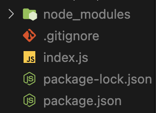

# Installing Express

## 1. json

- json: 프로그래머가 파일에 정보를 저장하기 위해 만든 방식 중 하나
- NodeJS의 경우, 파일의 이름이 **무조건** `package.json`이어야 함.

```
$ npm init
```

을 이용하면 쉽게 package.json을 구성할 수 있음. 그냥 시간을 아끼고 실수를 줄이기 위함.

```json
{
  "name": "clone-youtube",
  "version": "1.0.0",
  "description": "The best way to watch videos.",
  "scripts": {
    "test": "echo \"Error: no test specified\" && exit 1",
    "win": "node index.js"
  },
  "repository": {
    "type": "git",
    "url": "(https://github.com/hwanheejung/Clone-Youtube)"
  },
  "author": "Zoey",
  "license": "MIT",
  "dependencies": {
    "express": "^4.18.2"
  }
}
```

## 2. js 파일을 실행하는 방법

1. node를 이용하는 방법 : ex) `node index.js`
2. package.json에서 실행하는 방법 :
   - package.json 안에 main -> 내가 만들고 배포한 패키지를 다른 사람들이 설치하면 main을 사용한다. 필수 아님
   - 우리는 "scripts"를 사용해 볼 것. (scripts는 실행하고 싶은 것)
     ```json
     "scripts":{
         "start": "node index.js"
     }
     ```
     ```bash
     $ npm run start
     ```
     // package.json이 존재하는 폴더 한정

## 3. Installing Express

```
$ npm i express
```



- node_modules : npm으로 설치한 모든 패키지가 저장되는 곳
- express는 혼자 작동되지 않기 때문에 다른 패키지도 필요하다. express도 package.json을 가지고 있음.
- dependencies : express가 작동되기 위해 필요한 패키지
- express를 설치하면, express의 dependencies에 있는 패키지들도 함께 설치됨
- express를 설치하면, npm이 알아서 dependencies에 express를 추가해줌

<br/>

## 4. Express 사용법

index.js

```javascript
const express = require("express");
```
